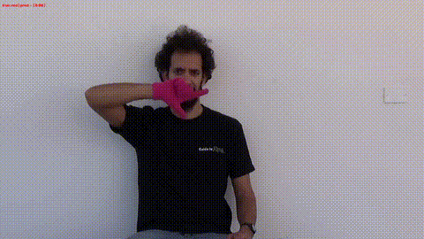
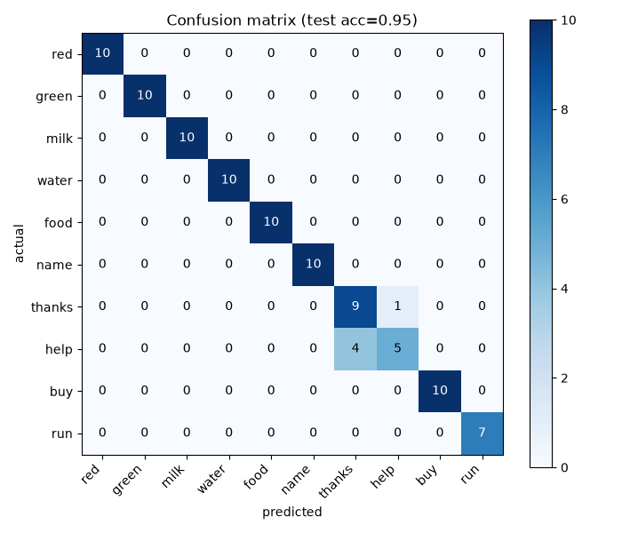

# Sign Language Recognition

Recognizes 10 signs from the [LSA64](https://facundoq.github.io/datasets/lsa64/) (Argentinian Sign Language) dataset from hand-landmark sequences, using MediaPipe for hand tracking and an LSTM for temporal classification.



*(replayed from a held-out test video the model never trained on — green text = correct prediction)*

## Pipeline

```
webcam / video frame
      │
      ▼
MediaPipe HandLandmarker   →  21 (x, y, z) landmarks per frame
      │
      ▼
normalize (wrist-centered, scale-invariant)  →  63-dim vector per frame
      │
      ▼
sliding window of 30 frames  →  (30, 63) sequence
      │
      ▼
LSTM (hidden=64) → last hidden state → linear layer  →  10-class logits
```

## Dataset

10 signs picked from LSA64's 64: `red`, `green`, `milk`, `water`, `food`, `name`, `thanks`, `help`, `buy`, `run` — 494 usable video clips across 10 subjects (5 repetitions each, a few clips dropped where no hand was detected).

**Split by subject, not by clip**: 6 subjects train / 2 val / 2 test, so the model is evaluated on people it never saw during training — a meaningfully harder and more honest test than splitting individual clips randomly.

## Model

A single-layer LSTM (hidden size 64, dropout 0.3) + linear output layer — ~33.7K parameters. Small on purpose: the input is a 63-number landmark vector per frame, not image pixels, so there's no need for a deep network here.

## Results

**94.8% accuracy on the held-out test set** (subjects never seen during training).



8 of 10 signs are classified perfectly. The one real confusion is `thanks` ↔ `help`.

## Known limitation: two-handed signs

LSA64 subjects wear a pink glove (right hand) and green glove (left hand). Three of the chosen signs — `thanks`, `help`, `run` — are two-handed, but this pipeline only tracks one hand (`HandLandmarker(num_hands=1)`). For `thanks`/`help`, both signs are performed near the face with a broadly similar single-hand shape, so the discarded second hand is very plausibly exactly the information needed to tell them apart. `run` still scored perfectly, likely because its one-hand motion is distinctive enough on its own.

This was diagnosed by inspecting reference frames per sign (`sign_language/`) rather than assumed — a natural next step (not yet done) would be extending `HandTracker` to track both hands and concatenating their landmarks.

Also worth naming: `normalize_landmarks()` deliberately makes each sequence translation-invariant (centered on the wrist), which is the right call for hand *shape*, but throws away *where* the hand is relative to the body — information real sign language also encodes and this model structurally can't see.

## Project layout

| file | step |
|---|---|
| `hand_tracker.py` | MediaPipe hand-landmark extraction + normalization |
| `gestures.py` | the 10-sign label set |
| `process_lsa64.py` | converts raw LSA64 videos → landmark sequences |
| `explore_data.py` | dataset sanity checks (class balance, shape checks, visual grid) |
| `split_data.py` | subject-based train/val/test split |
| `dataset.py` | loads a split into training-ready arrays |
| `model.py` | the `GestureLSTM` architecture |
| `train.py` | training loop, saves `model.pt` + `training_curves.png` |
| `evaluate.py` | test-set evaluation + confusion matrix |
| `live_demo.py` | live webcam inference |
| `replay_test.py` | runs the live-inference code path against real test videos (no webcam needed) |
| `make_reference_images.py` | saves one labeled reference frame per sign to `sign_language/` |

## Running it

```bash
python3.11 -m venv venv
./venv/bin/pip install opencv-python mediapipe numpy scikit-learn matplotlib
./venv/bin/pip install torch --index-url https://download.pytorch.org/whl/cpu

# download the MediaPipe hand landmark model
curl -L -o hand_landmarker.task "https://storage.googleapis.com/mediapipe-models/hand_landmarker/hand_landmarker/float16/1/hand_landmarker.task"

# download LSA64 (cut version, ~1.5GB) and extract into lsa64_raw/all_cut/
# see https://facundoq.github.io/datasets/lsa64/ for mirrors

./venv/bin/python process_lsa64.py   # video -> landmark sequences
./venv/bin/python explore_data.py    # sanity check
./venv/bin/python split_data.py      # train/val/test split
./venv/bin/python train.py           # train the LSTM
./venv/bin/python evaluate.py        # test-set accuracy + confusion matrix
./venv/bin/python replay_test.py     # replay test videos through the live pipeline
./venv/bin/python live_demo.py       # live webcam demo
```

*(Python 3.11 specifically — MediaPipe's Tasks API doesn't yet support newer versions.)*
